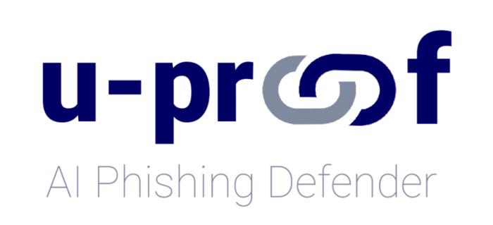
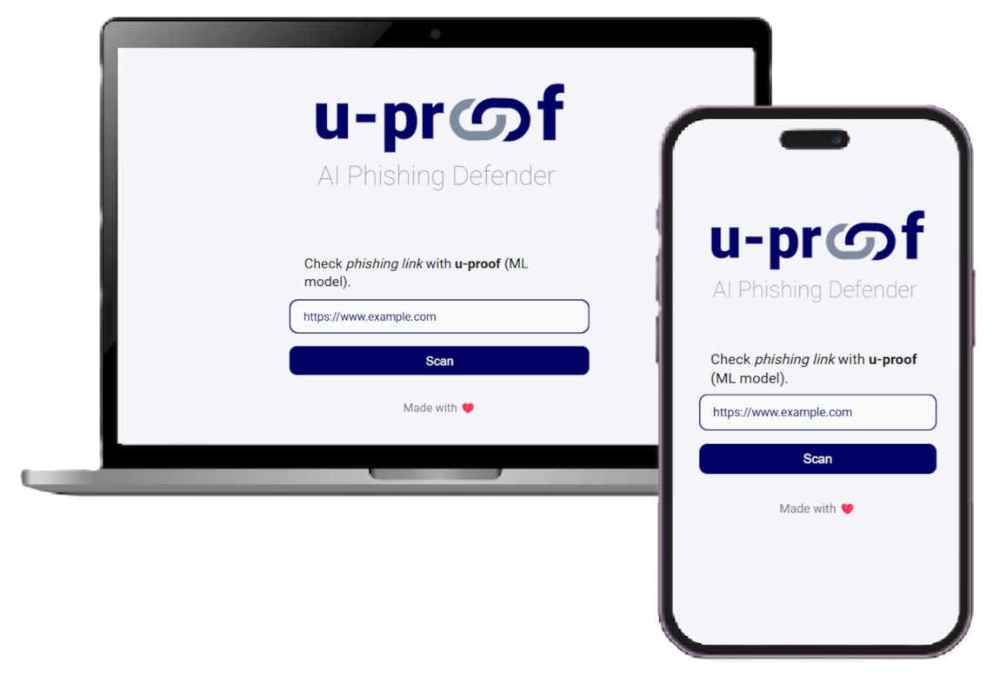
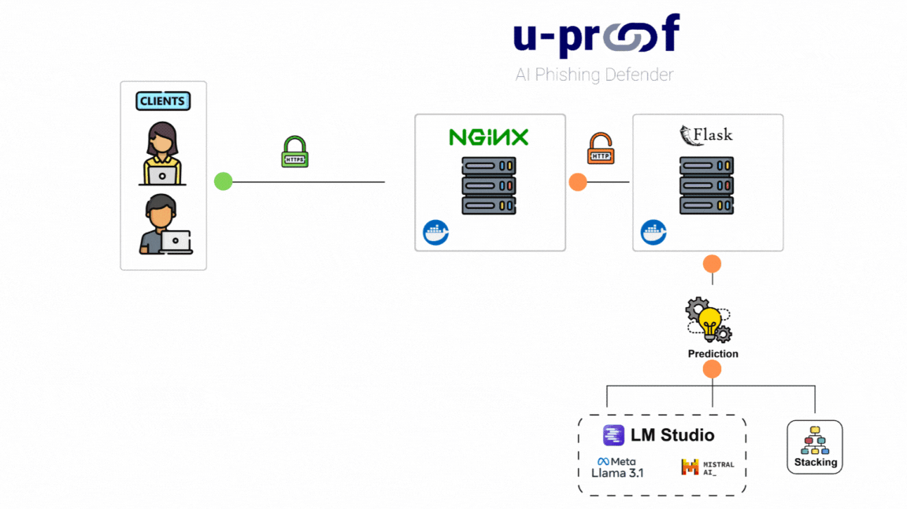
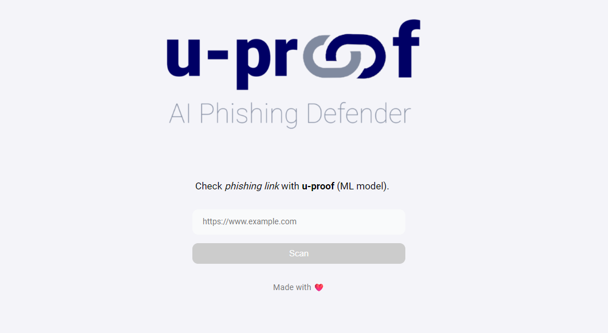
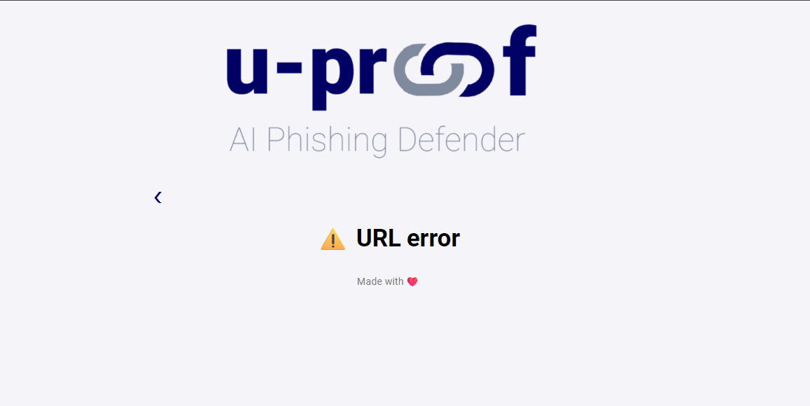
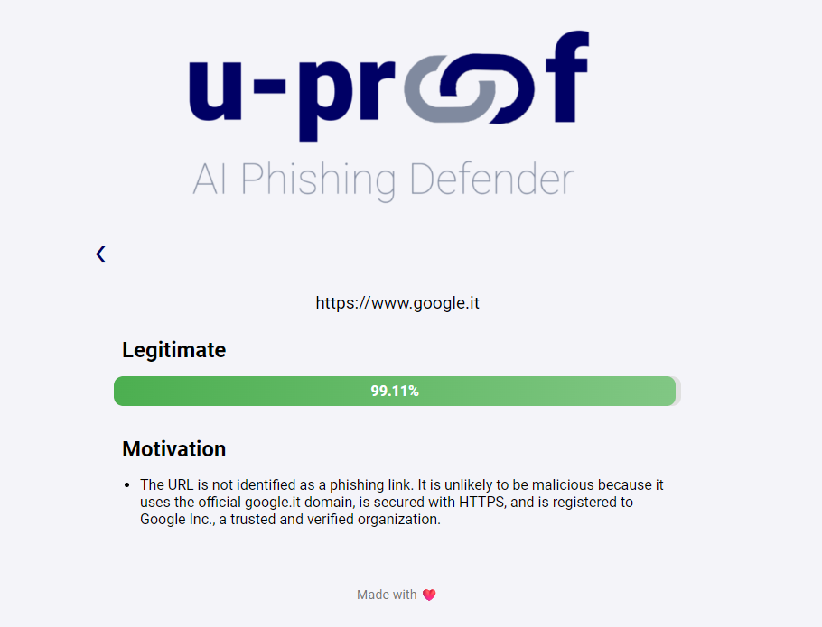
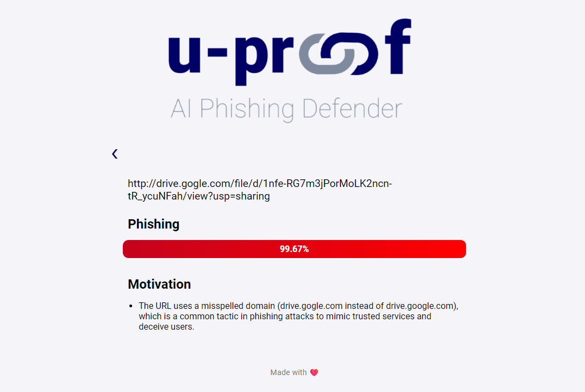

# u-proof


u-proof is a tool that harnesses the power of machine learning and LLM to identify potential phishing websites.

## Preview


## Requirements
- [Docker](https://www.docker.com/)
- [LM studio](https://lmstudio.ai/)
- Modern web browser

## Installation
``` bash
git clone https://github.com/carmine-ambrosino/u-proof.git
cd u-proof

docker compose up -d
```
## ⚠️ Note
- Make sure to set `API_LLM` and `MODELS` in `app/app/config.py` to properly configure the connection to [LM studio](https://lmstudio.ai/).

- Load first and enable JSON mode for LLM models in [LM studio](https://lmstudio.ai/).


## Used technologies
- **Flask:** Lightweight micro web framework written in Python.
- **LM Studio:** Tool to run local LLMs.
- **Docker:** Tool that is used to automate the deployment of applications in lightweight containers so that applications can work efficiently in different environments in isolation.
- **Docker Compose:** Tool for defining and running multi-container applications.

## Project structure


## App Screenshots
<p align="center">
  
  
</p>

<p align="center">
  
  
</p>

