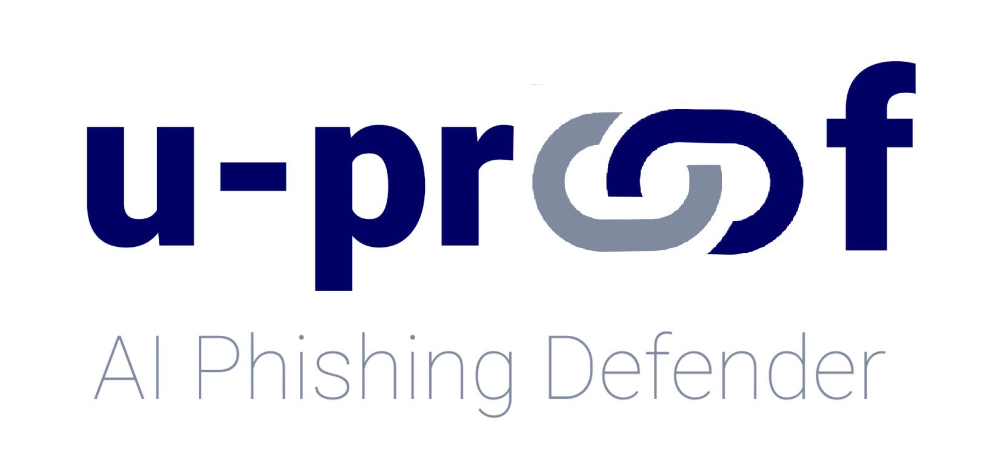
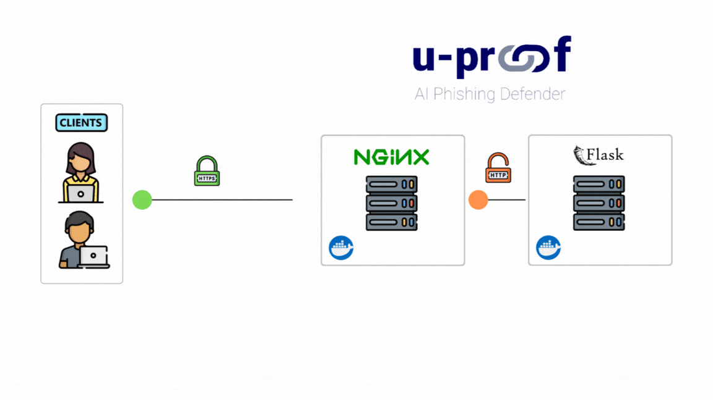
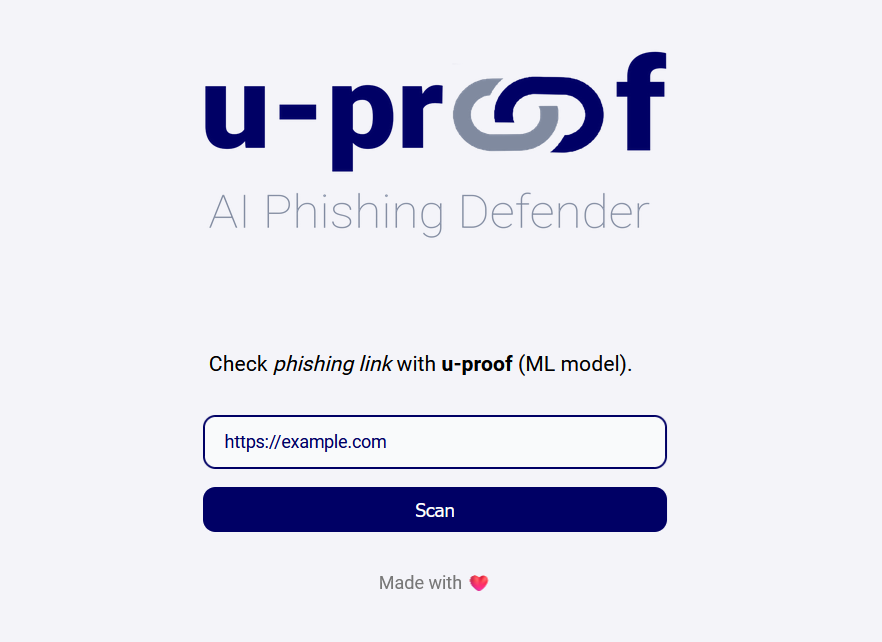

# u-proof

u-proof is a tool that harnesses the power of machine learning to identify potential phishing websites.

## Used technologies
- **Flask:** Lightweight micro web framework written in Python.
- **Docker:** Tool that is used to automate the deployment of applications in lightweight containers so that applications can work efficiently in different environments in isolation.
- **Docker Compose:** Tool for defining and running multi-container applications.

## Project structure


## Requirements
- [Docker](https://www.docker.com/)
- Modern web browser

## Installation
``` bash
git clone https://github.com/carmine-ambrosino/u-proof.git
cd u-proof

docker compose up -d
```

## Preview
